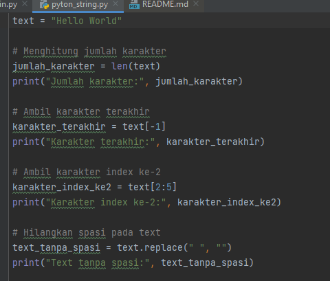
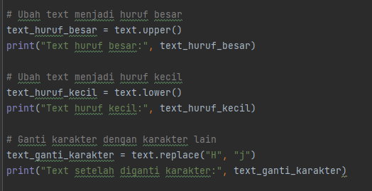
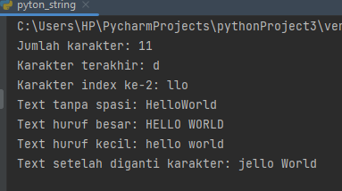

# latihan-pertemuan-14 

Pada latihan kali ini kita mengetahui cara,
* menhitung jumlah karakter pada string
* mengambil karakter pada string
* menghilangkan spasi
* mengubah text menjadi huruf besar
* mengubah text menjadi huruf kecil
* ganti karakter dengan karakter lain

 

## output

